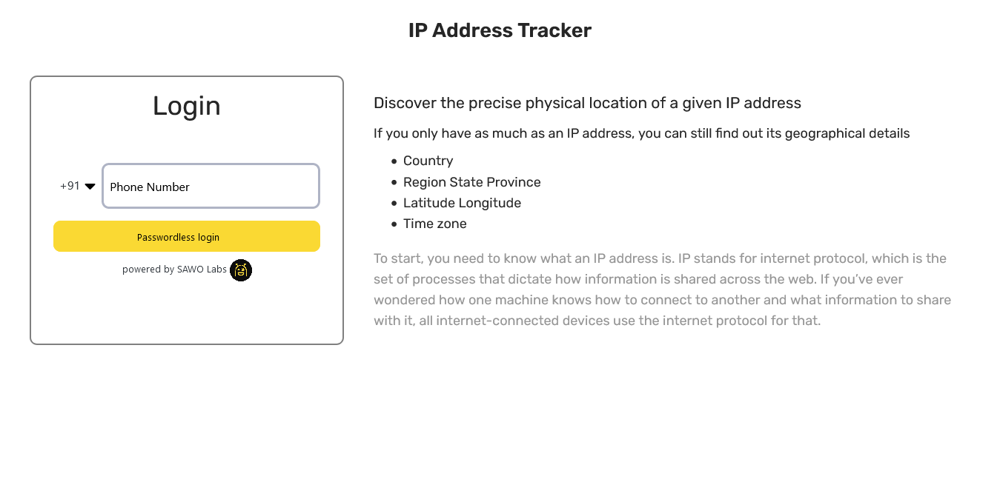
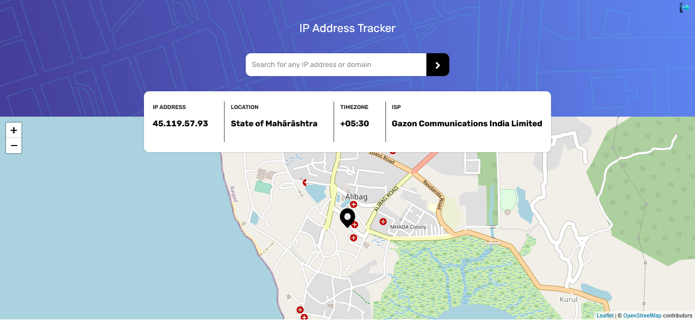
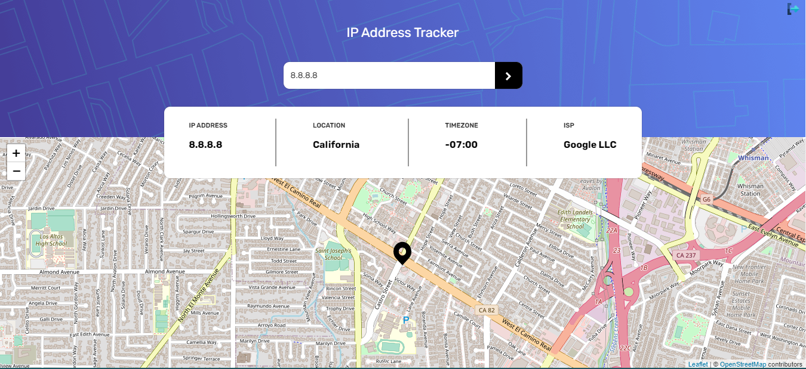
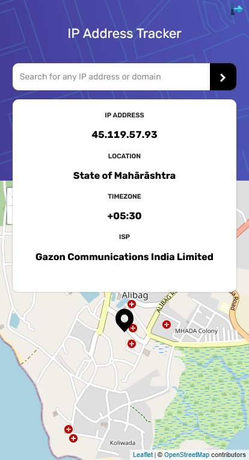

## Table of contents

- [Overview](#overview)
  - [The challenge](#the-challenge)
  - [Screenshot](#screenshot)
  - [Links](#links)
  - [Built with](#built-with-React)

## Overview

### The challenge

Users should be able to:

- Login using SAWO sdk (the passwordless way)
- View the optimal layout for each page depending on their device's screen size
- See hover states for all interactive elements on the page
- See their own IP address on the map on the initial page load
- Search for any IP addresses or domains and see the key information and location

### Screenshot

### Links

- Solution URL: [IP-Address-Tracker-code](https://github.com/kedareshubham11/IP-Address_Tracker)
- Live Site URL: [IP-Address-Tracker-live](https://kd-ip-address-tracker.herokuapp.com/)

## My process

### Built with

- Semantic HTML5 markup
- CSS custom properties
- CSS Grid
- antd
- [React](https://reactjs.org/) - JS library
  [IP Geolocation API by IPify](https://geo.ipify.org/)
  [LeafletJS](https://leafletjs.com/)
  [React-leaflet](https://react-leaflet.js.org/)
